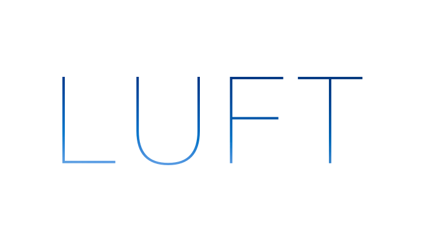

> Luft, the Swedish(and German) word for air. 

Luft aims helps your write shorter, lighter and more readable view controllers. Luft colors your Xcode gutter in a nice green when you're view controller is light. When it start to get a bit heavier the gutter turns yellow to warn you that it's time to start moving code to other places. If you ignore the warning the gutter eventually turns red as you add more code.

## Defaults

By default the following rules are used to determine the color of the gutter

| Number of lines  | Status |
|------------------|--------|
| < 150            | ✅     |
| >= 150 and <= 300| ⚠️     |
| > 300            | ⛔️     |
 

## License
MIT, see `LICENSE.md`
