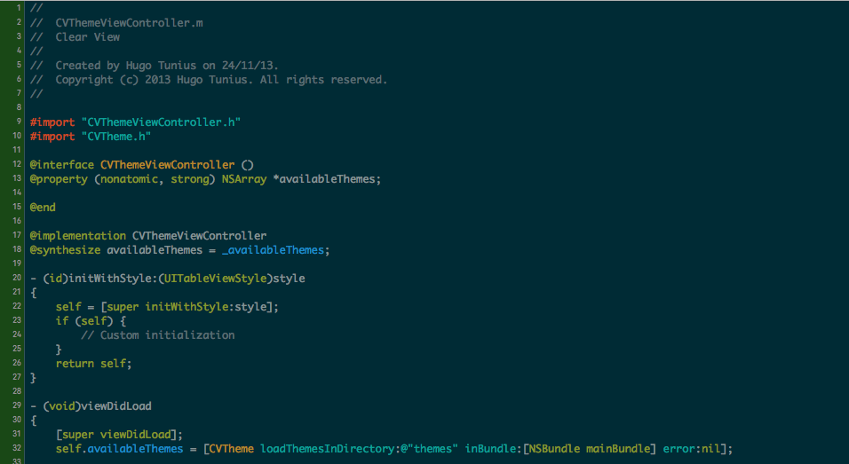

> Luft, the Swedish (and German, Danish and Norwegian) word for air.

Luft aims to help you write shorter, lighter and more readable view controllers. Luft colors your Xcode gutter in a nice green when your view controller is light. When it starts to get a bit heavier, the gutter turns yellow to warn you that it's time to start moving code to other places. If you ignore the warning the gutter eventually turns red as you add more code.

## Xcode 8 and Xcode Extensions

Unfortunately the introduction of Xcode extensions and changes to code signing requirements in Xcode 8 makes loading old plugins more difficult. You can still do it by stripping code signing from Xcode, but it's not something we recommend. I've raised the following radars for changes required to rebuild Luft with Xcode Extensions. Feel free to dupe them.

- https://openradar.appspot.com/radar?id=5503702324477952
- https://openradar.appspot.com/radar?id=4985435868626944
- https://openradar.appspot.com/radar?id=5001777682317312

## Installation

### Using Alcatraz

> Recommended

`Luft` can be installed via the [Alcatraz](http://alcatraz.io/) plugin manager.

If you don't have it installed, you can install it using:

```bash
curl -fsSL https://raw.githubusercontent.com/supermarin/Alcatraz/deploy/Scripts/install.sh | sh
```

After installing restart Xcode and go to `Window -> PackageManager`(cmd + 9). From there you can search for "Luft" and install it.

### Manually

```bash
$ git clone https://github.com/k0nserv/luft.git
$ cd luft
$ open Luft.xcodeproj
```

In Xcode press cmd + r

## Defaults

By default the following rules are used to determine the color of the gutter

| Number of lines  | Status |
|------------------|--------|
| < 150            | ✅     |
| >= 150 and <= 300| ⚠️     |
| > 300            | ⛔️     |

## Known Issues

+ Having the same file open in the assistant editor will not correctly reflect changes made in the active editor  
+ Other Issues? Please open a github issue. 

## Screenshots



## License
MIT, see `LICENSE.md`
